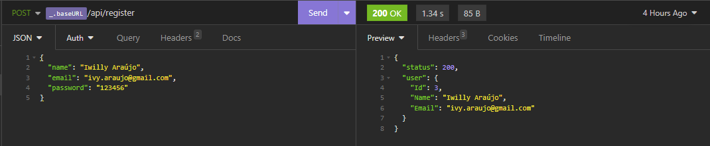
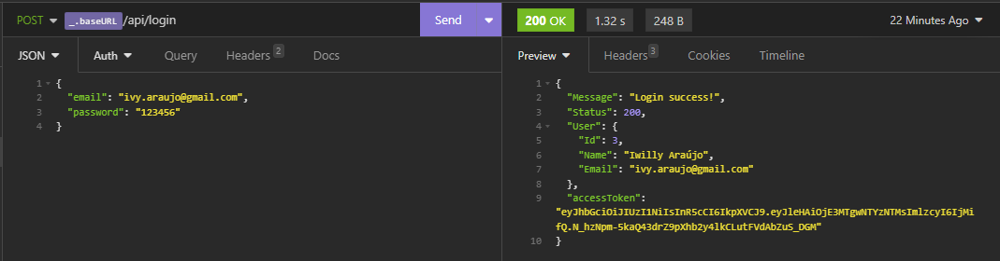

# GoLang simple jtw authentication

Certainly! Here's a comprehensive description for your application:

---

### Application Description

#### Overview

Our application is a robust, secure, and efficient web application developed in Go, leveraging the Fiber web framework. It is designed to offer high performance and scalability while ensuring secure user authentication and data management. The application integrates JWT for token-based authentication, MySQL for relational database management, Air for live reloading during development, and bcrypt for secure password hashing.

#### Key Features

1. **High Performance with Fiber**:

   - The application uses Fiber, an Express-inspired web framework built on top of Fasthttp, the fastest HTTP engine for Go. This ensures that the application handles requests swiftly and efficiently, providing an excellent user experience.

2. **Secure Authentication with JWT**:

   - The application implements JSON Web Tokens (JWT) for stateless, token-based authentication. This enhances security by ensuring that user sessions are managed securely without relying on server-side session storage.

3. **Robust Data Management with MySQL**:

   - MySQL is used as the relational database management system, providing reliable and scalable data storage solutions. The application utilizes GORM, a powerful ORM library for Go, to interact with the MySQL database seamlessly.

4. **Live Reloading with Air**:

   - During development, the application employs Air, a live reloading tool for Go applications. This boosts productivity by automatically reloading the server upon detecting changes in the codebase, allowing for faster development cycles.

5. **Secure Password Handling with bcrypt**:
   - For enhanced security, the application uses bcrypt to hash and store user passwords. Bcrypt is known for its robustness against brute-force attacks, ensuring that user credentials are stored securely.

#### Technical Stack

- **Programming Language**: Go
- **Web Framework**: Fiber
- **Database**: MySQL
- **Authentication**: JWT (JSON Web Tokens)
- **Password Hashing**: bcrypt
- **Live Reloading**: Air
- **ORM**: GORM (Go Object Relational Mapping)

#### Detailed Architecture

1. **API Endpoints**:

   - The application offers a two API endpoints, including user registration and login. These endpoints are designed to be RESTful, providing a predictable and consistent interface.

2. **Authentication Flow**:

   - On user registration, passwords are hashed using bcrypt before being stored in the MySQL database.
   - During login, the hashed password is compared with the stored hash to verify user credentials.
   - Upon successful authentication, a JWT token is generated and returned to the client, which will be used for subsequent authenticated requests.

3. **Database Management**:

   - Using GORM, the application defines models that map to MySQL tables. GORM handles the creation, migration, and interaction with these tables, abstracting away much of the complexity involved in database operations.

4. **Development Efficiency**:
   - With Air, developers enjoy a seamless development experience as the server automatically reloads whenever changes are detected in the codebase, reducing downtime and speeding up the development process.

#### Usage

The application is suitable for various use cases that require secure user authentication, efficient data management, and high performance. It can be adapted for e-commerce platforms, social media applications, content management systems, and more.

#### Examples

Register request:


Login request:


#### Installation and Setup

1. **Clone the Repository**:

   ```sh
   git clone https://github.com/eldersoon/go-jwt-auth.git
   cd go-jwt-auth
   ```

2. **Install Dependencies**:

   ```sh
   go mod download
   ```

3. **Setup MySQL Database**:

   - Create a MySQL database and update the database connection details in the application's configuration.

4. **Run the Application**:

   ```sh
   air
   ```

5. **Access the Application**:
   - The application will be accessible at `http://localhost:5000`.

#### Conclusion

This Go application, built with Fiber, JWT, MySQL, Air, and bcrypt, offers a robust and secure solution for web development needs. Its high performance, secure authentication, and efficient development workflow make it an excellent choice for developers aiming to build scalable and secure web applications.

---
